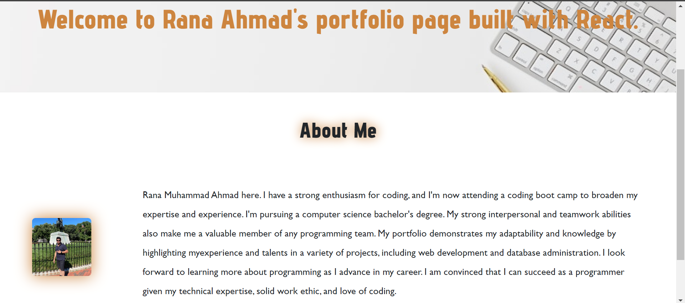
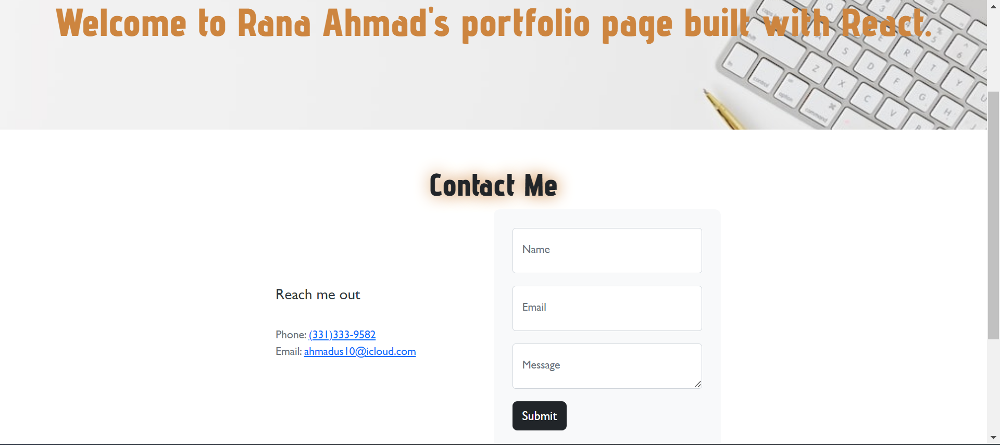
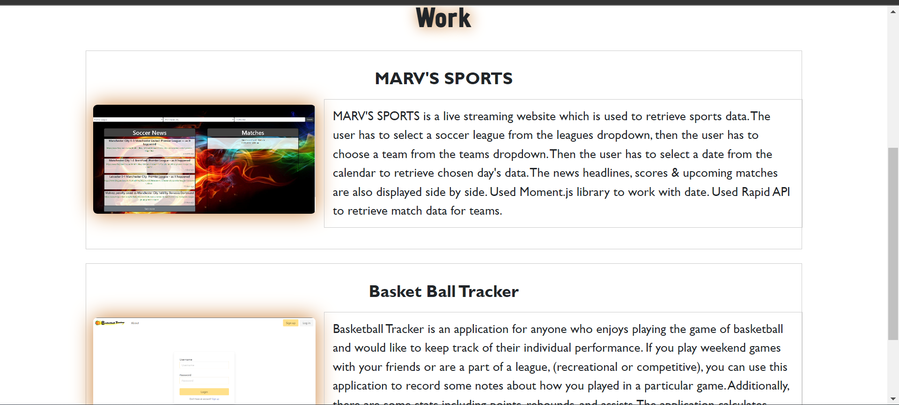
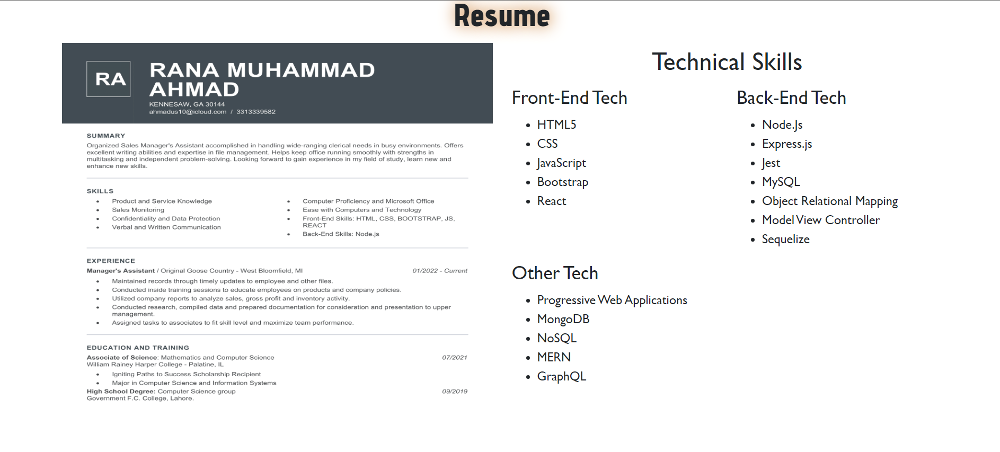

# PORTFOLIO-RANA
   
  ## Table of Contents
  - [Description](#description)  
  - [Usage](#usage)
  - [Contributing](#contributing)
  - [Questions](#Questions)
  

  ## Description
  🔍 I've developed a React portfolio to highlight my abilities, projects, and experience. You may read about me, check at my bootcamp projects, get in touch with me, and view my résumé.

  
  ## Usage
  💻  About
    

  
  💻  Portfolio
    

  💻  Contact
    

  💻  Resume                                    
     
 

  💻 Navigate to [Rana's Portfolio](https://rak100.github.io/portfolio-rana/) to view the web page  
    
    

  ## License 
  
    
     
  ## Questions
  ✋ Feel free to contact me for any questions: 
  
  ✉️ Email me with any questions: [ahmadus10@icloud.com](ahmadus10@icloud.com) 
  :octocat: Find me on GitHub: [rak100](https://github.com/rak100)